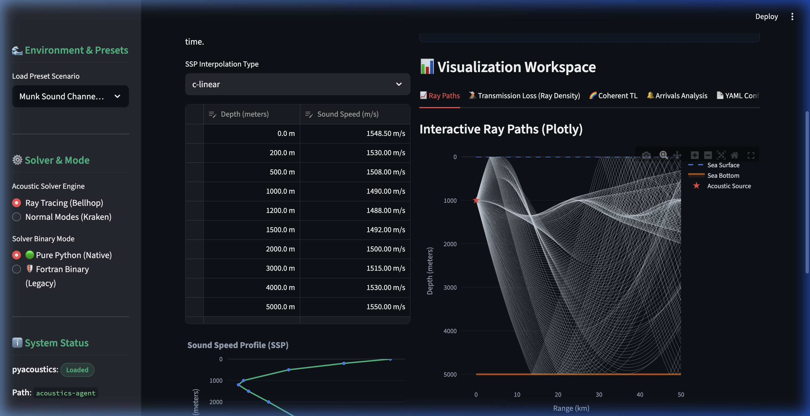

# Acoustics Agent Studio (acoustics-agent-app)

[ ](docs/User_Guide.md) [ ](docs/使用说明.md) [ ](README_zh.md)

`acoustics-agent-app` is a modern, interactive web application and decision studio built on top of the `acoustics-agent` AI-Native simulation framework.



It provides an intuitive and visually stunning Graphical User Interface (GUI) for oceanographers, underwater acoustic engineers, and researchers to design physical waveguides, execute ray-tracing and normal-mode simulations, analyze multipath arrivals, and map phase-coherent acoustic fields—all with standard Python scientific dependencies.

---

## ✨ Features

- **📊 Live SSP Designer**: Interactive Sound Speed Profile editor. Adjust table depths and sound speeds to see the profile update on a Plotly chart in real-time.
- **🚢 Waveguide & Environment Presets**: One-click configuration templates for benchmark waveguide scenarios:
  - **Munk Deep-Ocean Sound Channel** (deep-sea ducting)
  - **Pekeris Shallow-Water Waveguide** (sandy-bottom, shallow water boundary reflections)
  - **Surface Duct Channel** (upper mixed layer trapping)
- **📐 Complete Geometry Controls**: Full slider/numeric editors for source depth, water depth, sound frequency, launch angles, beam density, bottom properties, and step size.
- **📈 Interactive Ray-Path Trajectories**: Powered by Plotly and Matplotlib. Easily pan, zoom, and hover over simulated rays.
- **🌈 Coherent Transmission Loss Heatmaps**: Render phase-coherent acoustic interference patterns (striations) using high-fidelity **Gaussian Beam Summation**.
- **🌋 Incoherent TL Heatmaps**: Plot binned ray-density representations of energy loss.
- **🔔 Multipath & Impulse Analyzer**: Select specific receiver range/depth coordinates and calculate exact path arrivals, including travel time delay, amplitude, and boundary reflections.
- **🤖 Rule-Based AI Co-pilot**: Type commands in natural language (e.g. *"Set source depth to 150m, change frequency to 300Hz"*) to update dashboard parameters on the fly.
- **📄 YAML Configuration Sync**: Exports and syncs all parameters to standard `acoustics-agent` YAML configuration format with interactive download capability.

---

## 📁 Project Structure

```text
acoustics-agent-app/
├── .gitignore          # standard python, conda, and streamlit ignores
├── requirements.txt    # application dependencies
├── app.py              # core Streamlit application logic
└── README.md           # detailed design and guide (this file)
```

---

## 🚀 Getting Started

### 1. Prerequisites
Ensure you have a standard Python environment (preferably Anaconda or Miniconda) with standard scientific libraries. 

The application is designed to find and load `pyacoustics` from your local workspaces (`../acoustics-agent` or `../acoustics-agent-dev`) dynamically out of the box.

### 2. Install Dependencies
Navigate to the app folder and install the required UI libraries:
```bash
cd /Users/fengwei/VibeWorking/Coding/acoustics-agent-app
pip install -r requirements.txt
```

### 3. Run the Studio
Launch the Streamlit server:
```bash
streamlit run app.py
```
This will automatically open the web studio in your default browser at `http://localhost:8501`.

---

## ⚙️ Core Architecture

The dashboard is structured into a double-pane responsive design:
1. **Control Pane (Left Column)**: 
   - **Configuration Studio**: Input fields for setting up ocean depths, sources, boundaries, frequencies, and launching specifications.
   - **Sound Speed Profile**: Fully dynamic table input editor.
   - **AI Copilot**: An interactive interface parsing natural language commands into numeric updates.
2. **Operations Pane (Right Column)**:
   - **Run controls**: Action buttons for launching the fast ray tracers or calculating full coherent sound fields.
   - **Visualization Workspace**: Modular multi-tab area displaying Ray paths, Incoherent TL, Coherent TL, and Arrivals peaks.
