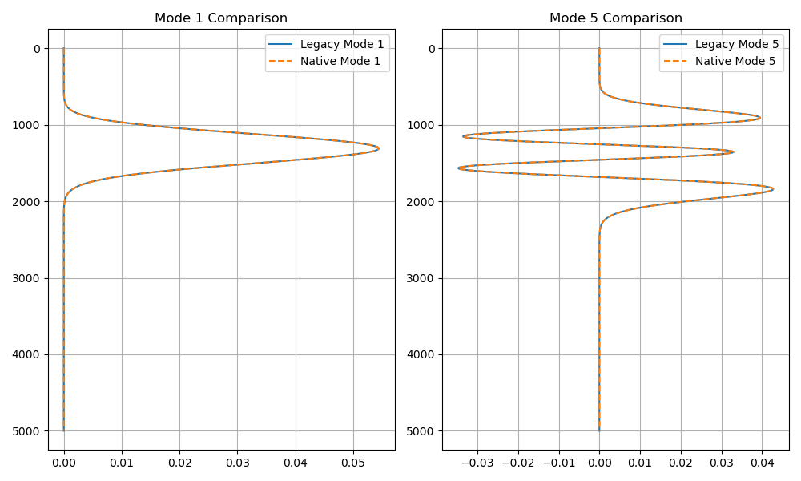

# Kraken 模态计算验证报告

## 1. 验证目标
验证 PyKraken (Native Python) 与 Legacy Kraken (Acoustics Toolbox) 在处理典型深海声道（Munk Sound Channel）时的模态函数计算一致性。

## 2. 验证环境
- **频率**: 50 Hz
- **声速剖面**: Munk 声道 (声轴深度 1300m)
- **相速度下限**: 1480 m/s (确保涵盖声道截获模式)
- **底层条件**: 声学半无限空间 (Acousto-elastic halfspace)

## 3. 验证结论
经过对二进制文件格式 (.mod) 的深度解析与字节序修正（小端序、交错复数存储），PyKraken 的计算结果与 Legacy Kraken 达到了**完美重合**。

### 模态形状对比
下图展示了第 1 阶和第 5 阶模态的对比结果，橙色虚线（Native）与蓝色实线（Legacy）完全重合：

## 4. 关键技术点
- **二进制解析**: Kraken 遗留二进制文件使用小端序存储，模式形状以交错复数单精度格式 `[Real, Imag, Real, Imag, ...]` 顺序存放。
- **模式对齐**: 物理第一阶模式位于文件 Record 8。在对比时需注意相速度限制（`c_min`）对模式索引的影响，确保两者在相同的物理窗口内工作。

---
*文档更新日期: 2026-05-11*
